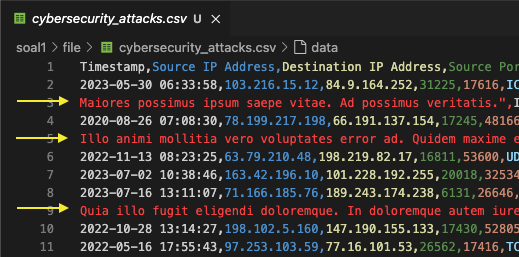

# itsec-test

## part 1
Take-Home Test Question: Cybersecurity Attack Data Quality Assessment

Dataset: https://www.kaggle.com/datasets/teamincribo/cyber-security-attacks

Your Task:
- Perform a data quality assessment on the dataset
- Explain any issue(s) founded
- Clean the data (if necessary)
- Interpret the data, including any anomaly or possible security issue(s)
---

### The Show :

#### Fix the new line
Before we start to assesment the data, we need to make-up the CSV first. 

The CSV contains "new line" at field `Payload Data` and it will cause the CSV to be broken. So we need to fix it.

You can see the details of this part in the following section -> [csv newline fixer](./soal1/csv_newline_fixer/readme.md)

>After fixing the CSV, we can start to assess the data quality.

#### 1.Data Quality Assessment.
Data Quality Assessment is a process to evaluate the quality of the data. It is used to identify any issues or errors in the data.

From DAMA perspective Data Quality have 6 dimensions, the most often used are: 
- Completeness
- Uniqueness
- Validity
- Consistency
- Timeliness
- Accuracy

In this case, we will assess the data quality of the dataset start from :

| Dimensions | Objective | Query Example |
| --- | --- | --- |
| Completeness | All required fields are present | `SELECT COUNT(*) FROM attacks WHERE column_name IS NULL` |
| Uniqueness | No duplicate records | `SELECT COUNT(*) FROM attacks GROUP BY column_name HAVING COUNT(*) > 1` |
| Validity | All values are valid | `SELECT COUNT(*) FROM attacks WHERE column_name NOT IN ('valid_value1', 'valid_value2')` |

#### 2.Issues Founded.
#### 3.Clean the data.
#### 4.Interpret the data.