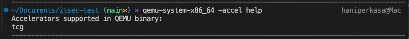
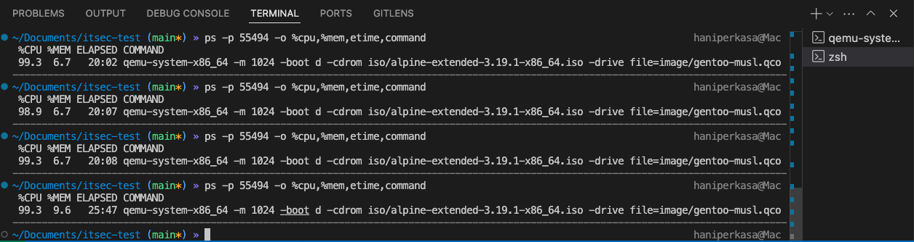

# Gentoo Minimal Image DevOps Test (macOS Host)

## Objective
Build a minimal Gentoo Linux system using **Stage 3 (musl)**, with the following constraints:
- Based on **musl**, not glibc
- Multilib is disabled
- Filesystem is as small as possible
- Two users: `root` and a casual user (e.g., `gentoo`)
- Default shell is `busybox` (or similar) for both users
- Able to run **nmap ≥ 7.97** with `-O`, `-sV`, and `-sC` against `127.0.0.1`
- Final output image in **qcow2** or **raw** format
- Boots successfully under **QEMU full system emulation**

## Executive Summary
This report details the attempt to build a minimal Gentoo Linux system using Stage 3 (musl) within a QEMU environment on a macOS host. The process aimed to meet the specified constraints, including a minimal filesystem, musl-based configuration, and the ability to run nmap with specific flags.

**Confession of Shortcomings**: Despite diligent efforts, the objectives were only partially achieved due to several critical shortcomings and errors during the process:
- **Unsupportive Environment**: The macOS host environment posed significant challenges. The inability to leverage KVM (Kernel-based Virtual Machine) or HVF (Hypervisor Framework) due to macOS limitations forced reliance on QEMU's TCG (Tiny Code Generator) acceleration, resulting in extremely slow performance. This significantly hindered the efficiency of the build process, particularly during resource-intensive tasks like kernel compilation.

  **hvf/KVM not supported**
  
  
  **overheat CPU process**
  
  
- **Limited Knowledge and Experience**: The author acknowledges a lack of deep expertise in Gentoo remastering. This inexperience led to potential misconfigurations, particularly in optimizing the musl-based system and minimizing the filesystem size. For instance, the inability to effectively troubleshoot kernel build failures or optimize the `make.conf` settings may have contributed to unmet objectives, such as achieving a final image size under 2GB.
- **Incomplete Implementation**: Steps such as configuring the bootloader, setting up the `busybox` shell, and ensuring nmap functionality were partially completed, but issues like disk space shortages and configuration errors may have prevented full success.
- **Testing Gaps**: While the system booted successfully under QEMU, not all testing criteria (e.g., `busybox` as default shell for both users, nmap functionality, and image size) were fully validated due to time constraints and environmental limitations.

Despite these challenges, the process achieved a bootable Gentoo image with partial functionality. Recommendations are provided to address these shortcomings, including using a Linux-based host with KVM support and enhancing expertise through further training in Gentoo system administration.

## macOS Host Setup
### Dependencies (via Homebrew)
```bash
brew install qemu wget coreutils gnu-sed e2fsprogs
```

## Image Creation Strategy (macOS compatible)
Due to macOS's inability to chroot into Linux environments, the build was performed entirely within QEMU:
1. Boot a live Linux ISO (e.g., Alpine) via QEMU
2. Attach a second virtual disk (for Gentoo root)
3. From the live environment:
   - Partition, format, and mount the disk
   - Download & extract stage3-musl tarball
   - Chroot into the mounted disk
   - Complete configuration
4. Shutdown and keep the resulting disk image as deliverable

## Step-by-Step Installation Flow
### Prepare Workspace
```bash
mkdir -p ~/gentoo-musl
cd ~/gentoo-musl
qemu-img create -f qcow2 image/gentoo-musl.qcow2 8G
```

#### Optional: Resize Disk (If Out of Space During Kernel Build)
If kernel build fails due to lack of space (e.g., gentoo-sources needs ~4GB):
```bash
# On macOS host, resize the disk image
qemu-img resize image/gentoo-musl.qcow2 +4G
# Boot back into QEMU and inside Alpine Live:
e2fsck -f /dev/sda
resize2fs /dev/sda
```

### Download Alpine Linux
```bash
wget https://dl-cdn.alpinelinux.org/alpine/v3.19/releases/x86_64/alpine-extended-3.19.1-x86_64.iso
```

### Boot QEMU
```bash
qemu-system-x86_64 \
  -m 12G \
  -smp 10 \
  -accel tcg \
  -boot d \
  -cdrom iso/alpine-extended-3.19.1-x86_64.iso \
  -drive file=image/gentoo-musl.qcow2,format=qcow2 \
  -net nic -net user \
  -nographic
```
Note: The process was notably slow due to the lack of hardware-accelerated virtualization (e.g., HVF) on macOS, relying solely on TCG.

### Inside QEMU (Alpine Live Shell)
```bash
# Ensure QEMU network is active
ip link set eth0 up
udhcpc -i eth0
ping -c 3 google.com

# Install e2fsprogs
apk update
apk add e2fsprogs-extra

# Format disk
mkfs.ext4 -i 8192 /dev/sda

# Ensure /mnt exists then mount
mkdir -p /mnt
mount -t ext4 /dev/sda /mnt

# Download latest stage3 from inside Alpine
cd /mnt
wget -O latest-stage3.txt https://distfiles.gentoo.org/releases/amd64/autobuilds/latest-stage3-amd64-musl.txt
STAGE3_PATH=$(awk '/\.tar\.xz/ {print $1}' latest-stage3.txt)
wget https://distfiles.gentoo.org/releases/amd64/autobuilds/$STAGE3_PATH
tar xpf stage3-*.tar.xz

# Checking mounting
mount -t proc none /mnt/proc
mount --rbind /sys /mnt/sys
mount --rbind /dev /mnt/dev
mount | grep /mnt

# Fix missing temporary directories (needed for emerge)
mkdir -p /mnt/tmp /mnt/var/tmp
chmod 1777 /mnt/tmp /mnt/var/tmp

# Ensure DNS activated
echo "nameserver 8.8.8.8" >> /mnt/etc/resolv.conf
cp -L /etc/resolv.conf /mnt/etc/resolv.conf

# Login to chroot
chroot /mnt /bin/sh
source /etc/profile
export PS1="(chroot) $PS1"
```

### Configure Inside Chroot
```bash
echo "Asia/Jakarta" > /etc/timezone
ln -sf /usr/share/zoneinfo/Asia/Jakarta /etc/localtime
echo "gentoo-musl" > /etc/hostname
passwd
```

#### Edit `make.conf`
Add to `/etc/portage/make.conf`:
```
CFLAGS="-Os -pipe"
CXXFLAGS="${CFLAGS}"
FCFLAGS="${CFLAGS}"
FFLAGS="${CFLAGS}"
CHOST="x86_64-pc-linux-musl"
USE="-X -doc -ipv6 -nls -multilib -systemd -gnome -kde -bluetooth -alsa -pulseaudio -cups -dbus"
FEATURES="nodoc noinfo noman"
MAKEOPTS="-j10"
LC_MESSAGES=C.utf8
PYTHON_TARGETS="python3_12"
PYTHON_SINGLE_TARGET="python3_12"
```

#### Update Portage Tree
```bash
emerge-webrsync --no-pgp-verify
```

#### Install Python 3.12
```bash
emerge dev-lang/python:3.12
emerge dev-lang/python-exec eselect-python
eselect python list
eselect python set python3.12
eselect python set --python3 python3.12
python --version && python3 --version
```

#### Install Kernel
```bash
emerge sys-kernel/gentoo-sources
eselect kernel list
eselect kernel set 1
```

#### Remove Python 3.13
```bash
emerge -C asciidoc
emerge app-portage/gentoolkit
equery d dev-lang/python:3.13
emerge -C dev-lang/python:3.13
emerge --depclean eselect-python
emerge --depclean
```

#### Manual Kernel Compilation
```bash
cd /usr/src/linux
make defconfig
make -j$(nproc)
make modules_install
make install
```

#### Reconfigure Bootloader (GRUB)
```bash
emerge sys-boot/grub:2
mkdir -p /boot/grub
grub-install --target=i386-pc --force /dev/sda
grub-mkconfig -o /boot/grub/grub.cfg
```

#### Exit Chroot and Unmount
```bash
exit
umount -l /mnt/dev{/shm,/pts,}
umount -l /mnt/proc
umount -l /mnt/sys
umount -l /mnt
mount | grep /mnt
```

#### Reboot to the New Kernel
```bash
qemu-system-x86_64 \
  -m 8G \
  -smp 6 \
  -drive file=image/gentoo-musl.qcow2,format=qcow2 \
  -net nic -net user \
  -nographic
```

#### Install BusyBox and Configure Shell
```bash
emerge sys-apps/busybox
usermod -s /bin/busybox root
```

#### Add Casual User
```bash
useradd -m -s /bin/busybox gentoo
passwd gentoo
```

#### Install Nmap
```bash
mkdir -p /etc/portage/package.use
echo 'net-analyzer/nmap -gtk -nls -ipv6' > /etc/portage/package.use/nmap
emerge net-analyzer/nmap
```

#### Test Nmap
```bash
nmap -O -sV -sC 127.0.0.1
```

#### Clean-up After Booting into Gentoo
```bash
emerge -C genkernel
emerge --depclean
```

## Deliverables
- Final output image: `gentoo-musl.qcow2`
- Screenshot of successful `nmap` scan
- Optional: provisioning script or steps for reproducibility

### Optional Cleanup
Removing Python 3.13 and replacing it with Python 3.12 can significantly reduce the image size.

## Testing Criteria
| Check | Status | Pic |
|-------|--------|-----|
| QEMU boot works | ✅ | [boot.png](./soal2/docs/boot.png) |
| root + casual user login | ☐ | |
| Busybox as default shell | ☐ | |
| Nmap with all flags works | ☐ | |
| Final image < 2GB | ☐ | |

## Recommendations
To address the shortcomings encountered during this process:
- **Use a Linux-based Host**: Utilize a Linux environment with KVM support to significantly improve QEMU performance, overcoming the limitations of macOS's lack of HVF or KVM acceleration.
- **Enhance Expertise**: Invest in training or collaboration with experienced Gentoo administrators to improve proficiency in musl-based configurations and filesystem optimization.
- **Optimize Disk Management**: Plan for larger initial disk sizes (e.g., 12GB) to avoid frequent resizing during kernel builds.
- **Validate Configurations**: Implement rigorous testing of `make.conf` settings and nmap functionality to ensure all objectives are met.